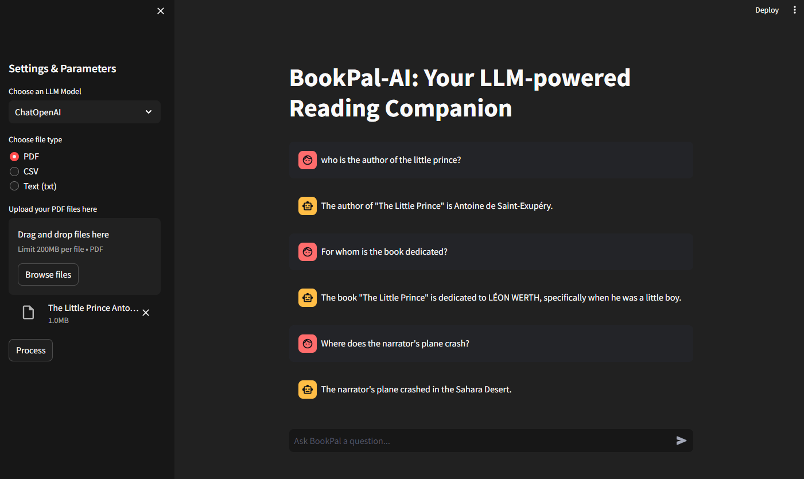

# BookPal-AI

**BookPal-AI** is a Python application designed to enhance your reading experience with the power of Language Models (LLMs). You can engage in natural language conversations about your documents, which may include PDFs, CSVs, or plain text files. BookPal-AI utilizes advanced language models, such as ChatOpenAI or instructor-xl, to provide accurate responses based on the content of your uploaded documents. Keep in mind that the application will respond only to questions related to the loaded documents.



## How to Use:

1. **Select an LLM Model:**
   - Choose between "ChatOpenAI" and "instructor-xl" in the sidebar.

2. **Choose File Type:**
   - Select the type of document you want to upload (PDF, CSV, or Text).

3. **Upload Documents:**
   - Use the file uploader to upload your documents.

4. **Process and Generate Response:**
   - Click the "Process" button to analyze the documents.

5. **Ask BookPal-AI:**
   - Type your questions in the text input box and receive responses.

## Installation & Requirements

1. **Clone the repository to your machine.**
2. Install the required packages and libraries by running the following command:
  ```
  pip install -r requirements.txt
  ```
3. **Obtain API keys:**
- Go to [OpenAI API keys](https://platform.openai.com/api-keys) and get your unique OpenAI API key.
- Then, go to [Hugging Face Tokens](https://huggingface.co/settings/tokens) and get your unique instructor-xl key.
- Lastly, add them to the `.env` file in your project directory.

4. **How to run:**
- Run the following command:
  ```
  streamlit run app.py
  ```

## Guides and resources used

- [Video 1](https://youtu.be/dXxQ0LR-3Hg?si=6xF5dAfpCp0-famf)
- [Video 2](https://youtu.be/MlK6SIjcjE8?si=QZsBV4B2g4G3uJ_Q)
- [Video 3](https://youtu.be/RIWbalZ7sTo?si=_3SOScGec5Oy4GP0)
